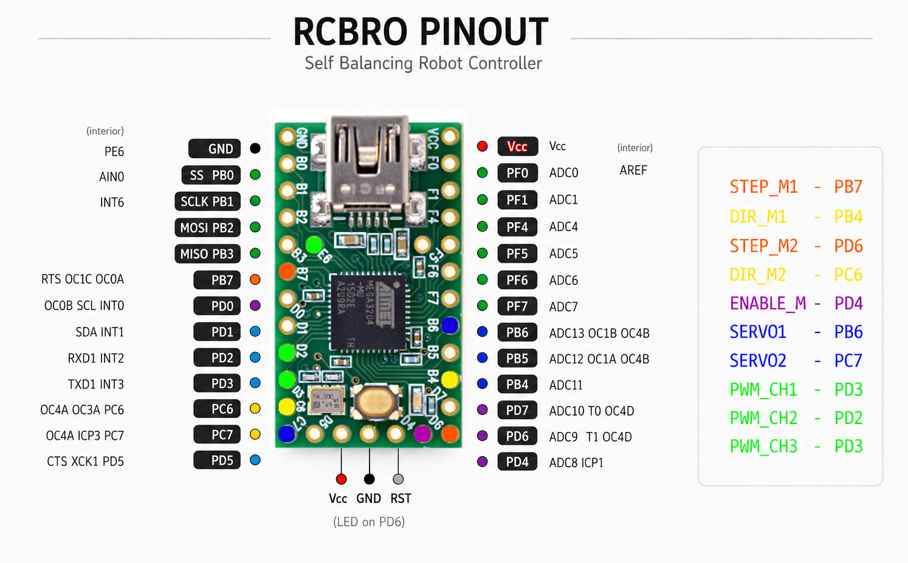

# RCBRO - RC Based Self Balancing Robot

Based on this project: https://github.com/jjrobots/B-ROBOT_EVO2

# Introduction
RCBRO is a Radio Control Based Self Balancing Robot. It is a two-wheeled robot that can balance itself using a 
gyroscope and accelerometer. The robot can be controlled using a remote control, allowing it to move forward, backward, and turn.

This project is designed around the Teensy 2.0 board, which feature a ATMega32U4 microcontroller. The Teensy 2.0 is a powerful 
and versatile microcontroller that is well-suited for robotics projects. It has a built-in USB interface, which allows for 
easy programming and communication with the robot.

## Pinout
The pinout for the Teensy 2.0 board is as follows:

# Transmitter

The RC transmitter used in this project is a 3-channel FlySky FS-GT3B transmitter. It operates on the 2.4GHz 
frequency and has a range of up to 500 meters. The transmitter has a built-in LCD screen that displays the current 
channel and battery status.

The transmitter is flashed with [Custom Firmare 0.6.1](https://github.com/semerad/gt3b/tree/master), which allows for better control and customization of the transmitter. 
The custom firmware also allows for the use of additional channels, which can be used for controlling additional features of the robot.

Newer versions of the transmitter has to be tweaked a little to be able to bind with the receiver. Check the RC folder for more details.

## RC Channel Mapping

| Channel | Pin (Teensy 2.0) | Function                      |
|---------|------------------|-------------------------------|
| CH1     | D3 (INT3)        | Steering                      |
| CH2     | D2 (INT2)        | Throttle                      |
| CH3     | E6 (INT6)        | ARM (high) / PRO toggle (low) |

### CH3 functions
- **≤ 1200 µs** — Toggle PRO mode on/off (edge triggered)
- **~1500 µs** — Normal operation
- **≥ 1800 µs** — Activate servo arm

### CH3 Configuration
To configure CH3 for the desired functions (ARM and Pro-mode toggler).

Check the manual for more details: [FlySky FS-GT3B Custom Firmware Manual](RC/gt3b_fw_manual.pdf)

1. Choose REV and Long press the ENTER button.
2. Choose 3 CH3
3. Behavior: BMO (Behavior Mode - Momentary)
4. Reverse: RE0 (Reverse Off)
5. Previous Value: PV0 - No change in function

## Tuning

Key parameters in `RCBRO.ino` to tune for your build:

| Parameter                         | Description                    | Adjust if...                                          |
|-----------------------------------|--------------------------------|-------------------------------------------------------|
| `MAX_THROTTLE`                    | Max speed in normal mode       | Robot tips at full speed → lower it                   |
| `MAX_TARGET_ANGLE`                | Max lean in normal mode        | Robot tips at full speed → lower it                   |
| `MAX_THROTTLE_PRO`                | Max speed in PRO mode          | Same as above, for PRO                                |
| `MAX_TARGET_ANGLE_PRO`            | Max lean in PRO mode           | Same as above, for PRO                                |
| `ANGLE_OFFSET`                    | Balance trim                   | Robot drifts forward/backward at rest                 |
| `KP` / `KD`                       | Balance PD gains               | Robot oscillates (lower) or sluggish (raise)          |
| `KP_THROTTLE` / `KI_THROTTLE`     | Speed PI gains                 | Speed response too slow / too aggressive              |
| `MAX_ACCEL`                       | Motor acceleration limit       | Motors skip steps (lower) or response is slow (raise) |
| `EXPO_STEERING` / `EXPO_THROTTLE` | Stick expo (0=linear, 1=cubic) | Centre feel too twitchy or too soft                   |
